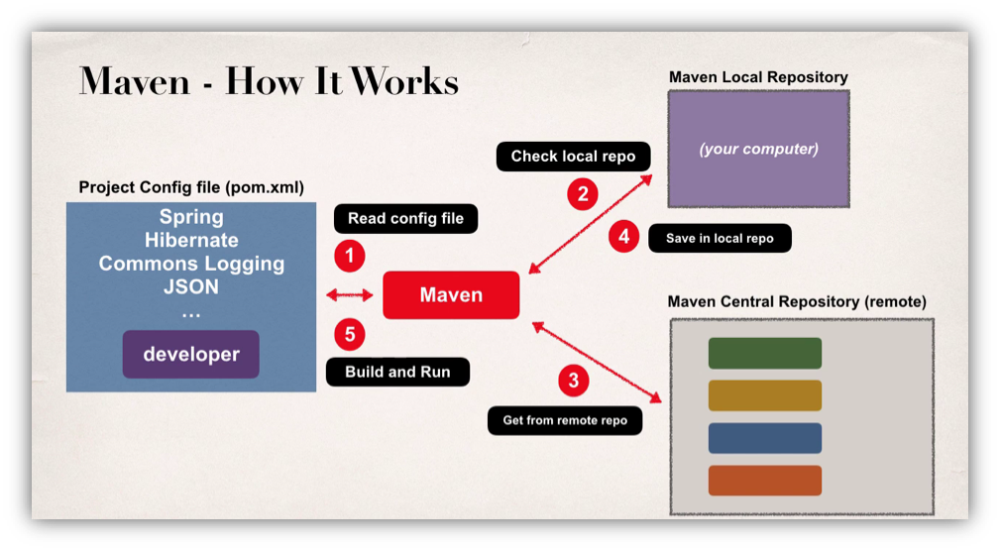

## Introduction
Ce workshop vise à simplifier la culture DevOps pour les debutants


## Setup your environment

Pour ce workshop, nous aurons besoin de java 8, maven, git et docker. Tout ces requis sont disponibles pour les systèmes d'exploitation Linux et Windows

### Install Java 8

#### On Linux Centos/RHEL
<details>
  <summary>Click to expand!</summary>

1.	Nous utiliserons open java pour notre démo, Obtenez la dernière version de http://openjdk.java.net/install/
  ```
  sudo yum install java-1.8*
  ```

2.	Configuration de la variable d'environnement JAVA_HOME
  1.	Déterminez le bon emplacement de la version JAVA8.
  ```
  find /usr/lib/jvm/java-1.8* | head -n 3
  ```
  2.	Créez un fichier appelé java.sh dans le répertoire /etc/profile.d/
  ```
  vi /etc/profile.d/java.sh
  ```
  3.	Ajoutez le contenu suivant
  ```
  #!/bin/bash
  export JAVA_HOME=/usr/lib/jvm/java-1.8.0-openjdk-1.8.0.282.b08-1.el7_9.x86_64
  export PATH=$PATH:$JAVA_HOME
  ```
  NB: vous devez changer le chemin du java /usr/lib/jvm/java-1.8.0-*****x86_64. Par le chemin généré dans la commande précédente.
  4.	Enregistrez et fermez le fichier. Rendez-le exécutable à l'aide de la commande suivante.
  ```
  chmod +x /etc/profile.d/java.sh
  ```
  5.	Ensuite, définissez les variables d'environnement de manière permanente en exécutant la commande suivante :
  ```
  source /etc/profile.d/java.sh
  ```
  6.	Maintenant, vérifiez la version de fourmi en utilisant la commande :
  ```
  java -version
  ```

</details>

#### On Linux Ubuntu
<details>
  <summary>Click to expand!</summary>

- Pour installer OpenJDK 8, exécutez la commande suivante :
```
sudo apt install openjdk-8-jdk
```
- Vérifiez que celui-ci est installé avec :

  ```
  java -version
  ```

  Vous verrez une sortie de ce type :

  Output
  ```
  openjdk version "1.8.0_162"
  OpenJDK Runtime Environment (build 1.8.0_162-8u162-b12-1-b12)
  OpenJDK 64-Bit Server VM (build 25.162-b12, mixed mode)
  ```
  Il est également possible d'installer uniquement le JRE, ce que vous pouvez faire en exécutant sudo apt install openjdk-8-jre.

-	Configuration de la variable d'environnement JAVA_HOME
  1.	Déterminez le bon emplacement de la version JAVA8.
  ```
  find /usr/lib/jvm/java-1.8* | head -n 3
  ```
  2.	Créez un fichier appelé java.sh dans le répertoire /etc/profile.d/
  ```
  vi /etc/profile.d/java.sh
  ```
  3.	Ajoutez le contenu suivant
  ```
  #!/bin/bash
  export JAVA_HOME=/usr/lib/jvm/java-1.8.0-openjdk-1.8.0.282.b08-1.el7_9.x86_64
  export PATH=$PATH:$JAVA_HOME
  ```
  NB: vous devez changer le chemin du java /usr/lib/jvm/java-1.8.0-*****x86_64. Par le chemin généré dans la commande précédente.
  4.	Enregistrez et fermez le fichier. Rendez-le exécutable à l'aide de la commande suivante.
  ```
  chmod +x /etc/profile.d/java.sh
  ```
  5.	Ensuite, définissez les variables d'environnement de manière permanente en exécutant la commande suivante :
  ```
  source /etc/profile.d/java.sh
  ```
  6.	Maintenant, vérifiez la version de fourmi en utilisant la commande :
  ```
  java -version
  ```

</details>

### Install maven

#### On Windows
<details>
  <summary>Click to expand!</summary>

Etape 1: Télécharger Maven
- Télécharger Maven depuis son site web officiel https://maven.apache.org/download.cgi/
- Choisir une version adaptée au système d’exploitation hôte.

Etape 2: Installer Maven
- Ouvrez l'invite de commande.
- À partir de l'invite de commande, accédez au répertoire où le fichier apache-maven-x.x.x-bin.zip est enregistré et décompressez l’archive sous le chemin :
```
C:\maven\apache-maven-x.x.x
```
- Exécutez les commandes suivantes pour paramétrer les variables d’environnement requises pour le fonctionnement de Maven:
 - Définir la variable d'environnement JAVA_HOME :
  ```
  SET JAVA_HOME=”C:\Program Files\Java\jdk1.8.0_xxx”
  ```
 - Définir la variable d'environnement M2_HOME :
  ```
  SET M2_HOME=C:\integ_continue\maven\apache-maven-x.x.x
  ```
 - Définir la variable d'environnement M2 :
  ```
  SET M2=%M2_HOME%\bin
  ```
 - Ajouter les commandes Maven dans le PATH du système d’exploitation :
  ```
  SET PATH=%PATH%;%M2%
  ```

- Testez l’installation de Maven en exécutant la commande:
```
mvn -version
```
</details>


#### On Linux (Centos/RHEL/Ubuntu/Debian)
<details>
  <summary>Click to expand!</summary>

- Télécharger Maven depuis son site web officiel https://maven.apache.org/download.cgi/
- Choisir et télécharger une version adaptée au système d’exploitation hôte.
```
wget https://downloads.apache.org/maven/maven-3/3.8.0/binaries/apache-maven-3.8.0-bin.tar.gz
```
- Extraire l'archive de distribution dans le dossier /opt
```
tar xzvf apache-maven-* -C /opt
```
- Créez un fichier appelé maven.sh dans le répertoire /etc/profile.d/
```
vi /etc/profile.d/maven.sh
```
- Ajoutez le contenu suivant
```
#!/bin/bash

export M2_HOME=/opt/apache-maven-3.6.3
export M2=$M2_HOME/bin
export PATH=$PATH:$M2
```
NB: vous devez changer le chemin de l’outil maven par celui installé dans votre instance.
- Enregistrez et fermez le fichier. Rendez-le exécutable à l'aide de la commande suivante.
```
chmod +x /etc/profile.d/maven.sh
```
- Ensuite, définissez les variables d'environnement de manière permanente en exécutant la commande suivante :
```
source /etc/profile.d/maven.sh
```
- Maintenant, vérifiez la version de fourni en utilisant la commande :
```
mvn -version
```
</details>

## Generating Maven Project

### Maven repository


### Project Object Model « pom.xml »
POM signifie "Project Object Model". Il s'agit d'une représentation XML d'un projet Maven contenu dans un fichier nommé pom.xml.
**Exemple**
```xml
<project xmlns="http://maven.apache.org/POM/4.0.0" xmlns:xsi="http://www.w3.org/2001/XMLSchema-instance"
xsi:schemaLocation="http://maven.apache.org/POM/4.0.0 https://maven.apache.org/xsd/maven-4.0.0.xsd">
  <modelVersion>4.0.0</modelVersion>
  <packaging>jar</packaging>
   
  <groupId>org.codehaus.mojo</groupId>
  <artifactId>my-project</artifactId>
  <version>1.0</version>

  <dependencies>...</dependencies>
  <plugins> ... </plugins>

  <!-- Build Settings -->
  <build>...</build>
  <reporting>...</reporting>
</project>
```

### Générer une Application java de type Maven
- Générer l’architecture du projet
```
mvn archetype:generate
```
- Choisir le code par défaut (1854)
```
Choose a number or apply filter (format: [groupId:]artifactId, case sensitive contains): 1854:
Choose org.apache.maven.archetypes:maven-archetype-quickstart version:
1: 1.0-alpha-1
2: 1.0-alpha-2
3: 1.0-alpha-3
4: 1.0-alpha-4
5: 1.0
6: 1.1
7: 1.3
8: 1.4
Choose a number: 8:
Define value for property 'groupId': org.devops
Define value for property 'artifactId': AppJavaMaven
Define value for property 'version' 1.0-SNAPSHOT: :
Define value for property 'package' org.devops: :
Confirm properties configuration:
groupId: org.devops
artifactId: AppJavaMaven
version: 1.0-SNAPSHOT
package: org.devops
 Y: : y
```
- Vérifier l’architecture du projet
```
[root@worker-node1 ~]# tree AppJavaMaven/
AppJavaMaven/
├── pom.xml
└── src
    ├── main
    │   └── java
    │       └── org
    │           └── devops
    │               └── App.java
    └── test
        └── java
            └── org
                └── devops
                    └── AppTest.java

```
-	Compiler le projet
```
[root@worker-node1 AppJavaMaven]# mvn compile
```
-	Créer un package
```
[root@worker-node1 AppJavaMaven]# mvn package
```
-	Vérifier le résultat
```
[root@worker-node1 AppJavaMaven]# tree
.
├── pom.xml
├── src
│   ├── main
│   │   └── java
│   │       └── org
│   │           └── devops
│   │               └── App.java
│   └── test
│       └── java
│           └── org
│               └── devops
│                   └── AppTest.java
└── target
    ├── AppJavaMaven-1.0-SNAPSHOT.jar
    ├── classes
    │   └── org
    │       └── devops
    │               └── App.class
    ├── generated-sources
    │   └── annotations
    ├── generated-test-sources
    │   └── test-annotations
    ├── maven-archiver
    │   └── pom.properties
    ├── maven-status
    │   └── maven-compiler-plugin
    │       ├── compile
    │       │   └── default-compile
    │       │       ├── createdFiles.lst
    │       │       └── inputFiles.lst
    │       └── testCompile
    │           └── default-testCompile
    │               ├── createdFiles.lst
    │               └── inputFiles.lst
    ├── surefire-reports
    │   ├── org.devops.AppTest.txt
    │   └── TEST-org.devops.AppTest.xml
    └── test-classes
        └── org
            └── devops
                └── AppTest.class

32 directories, 13 files
```
-	Tester le projet
```
[root@worker-node1 AppJavaMaven]# java -cp target/AppJavaMaven-1.0-SNAPSHOT.jar org.devops.App
Hello World!
```

### Générer une Application Web
-	Générer l’architecture du projet webapp
```
mvn archetype:generate -DarchetypeGroupId=org.apache.maven.archetypes      -DarchetypeArtifactId=maven-archetype-webapp -DarchetypeVersion=1.4
```
-	Vérifier l’architecture du projet
```
[root@worker-node1 ~]# tree webapp/
webapp/
├── pom.xml
└── src
    └── main
        └── webapp
            ├── index.jsp
            └── WEB-INF
                └── web.xml
4 directories, 3 files
```
-	Ajout du plugin Jetty pour tester rapidement l’application web créée. Modifier le fichier pom.xml et ajouter la définition du plugin
```
...
<plugin>
    <groupId>org.mortbay.jetty</groupId>
    <artifactId>maven-jetty-plugin</artifactId>
    <version>6.1.26</version>
</plugin>
...
```
-	Exécuter le plugin Jetty 
```
mvn jetty:run
```
-	Tester l’application à partir d’un navigateur web sur le port 8080
-	Modifier le code de la page index.jsp et vérifier les mises à jour
