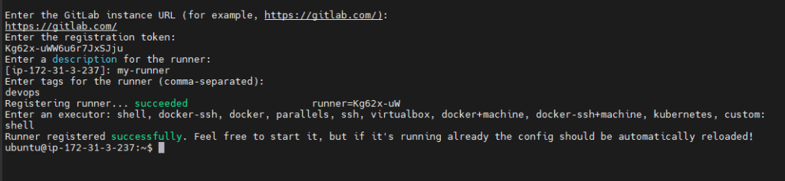

Gitlab offre un outil d'integration continue lié aux répos git qu'il héberge.
Vous pouvez configurer l'intégration continue de votre projet avec un fichier de configuration appelé `.gitlab-ci.yml` qui doit résider dans la racine de votre projet.

Vous trouvez des exemples de chaines CI pour différents projets dans [https://docs.gitlab.com/ee/ci/examples/#cicd-templates](https://docs.gitlab.com/ee/ci/examples/#cicd-templates)

## Créer une chaine/pipeline CI avec gitlab-ci

- Commencez par créer un fichier .gitlab-ci.yml dans la racine du projet dans la branche master

- Ajoutez le contenu suivant dans ce fichier:

```yaml
stages:
  - build

build:
  stage: build
  script:
  - mvn compile
```

On définit ici une chaine à une seule étape (stage) `build` contenant une seule action `build`, dans cette action on fait appel à un script pour exécuter la commande `mvn compile`.
Un script peut exécuter une liste de commandes, une par ligne.

- Commitez et publiez votre projet sur gitlab. vous devez remarquer que GitLab a essayé d'exécuter votre pipeline ci mais il a échoué, parce qu'il ne trouve pas `mvn`

### Notions de runner

GitLab utilise des `runners` pour exécuter les pipelines ci, ces runners tournent sur des systèmes d'exploitation et nécessitent l'existence des outils de construction (Maven) et les dépendances du projets.

En général, GitLab exécute votre pipeline ci dans des shared runners offerts par GitLab lui même, qui ne permettent que la compilation et la construction du projet mais pas le déploiement.

Vous devez récupérer votre package suite à la construction sur des shared runners, ou utiliser un runner privé installé chez vous.

### Installer gitlab runner sur votre machine

#### installer GitLab Runner sur Windows

visiter ce lien pour toutes les étapes: [https://docs.gitlab.com/runner/install/windows.html](https://docs.gitlab.com/runner/install/windows.html)

#### installer GitLab Runner sur Ubuntu
* Étape 1 : Ajouter le référentiel GitLab officiel

Ajoutez d'abord le référentiel GitLab officiel à l'aide de la commande ci-dessous, pour vérifier le dernier référentiel Gitlab, visitez la page officielle de GitLab Runner
```
curl -L "https://packages.gitlab.com/install/repositories/runner/gitlab-runner/script.deb.sh" | bash sudo
```
* Étape 2 : Installez GitLab Runner sur Ubuntu

Exécutez la commande ci-dessous pour installer le dernier GitLab Runner sur Ubuntu
```
sudo apt-get install gitlab-runner
```
utilisez les commandes ci-dessous pour installer une version spécifique de GitLab Runner sur Ubuntu.
```
apt-cache madison gitlab-runner
sudo apt-get install gitlab-runner=10.0.0
```
Commande pour vérifier la version de GitLab Runner
```
sudo gitlab-runner -version
```
Pour vérifier l'état si le service GitLab Runner est en cours d'exécution ou non
```
statut sudo gitlab-runner
```
Commandes pour démarrer, arrêter et redémarrer GitLab Runner
```
sudo gitlab-runner start
sudo gitlab-runner stop
sudo gitlab-runner restart
```

#### Enregistrer GitLab-Runner
* Étape 1 : Pour enregistrer GitLab-Runner, exécutez la commande ci-dessous :
```
sudo gitlab-runner registre
```
* Étape 2 : Entrez ensuite l'URL et le jeton d'enregistrement du compte GitLab

  -  Accédez au compte GitLab
  -  Cliquez sur Projet
  -  Cliquez ensuite sur réglage et en dessous cliquez sur CI/CD
  -  Cliquez sur Runner Expand faites défiler vers le bas et copiez l'URL et le jeton d'enregistrement
  -  Et coller sur la commande

* Étape 3: Ensuite, vous pouvez donner une description complète du runner

* Étape 4 : Entrez ensuite les tags pour le runner (n'importe quelle balise)

* Étape 5 : Choisissez ensuite n'importe quel exécuteur - shell , ssh , docker , etc.


### Lancer le pipeline ci

Le pipeline ci sur GitLab sera lancé immédiatement suite à un push dans les branches qui disposent d'un fichier `.gitlab-ci.yml`.
Cependant, vous pouvez le lancer manuellement à partir du dashboard de votre répo GitLab.

- Allez sur le menu CI/CD
- Cliquez sur pipelines
- Cliquez sur le bouton `Run pipeline`

## Tester le code dans le pipeline ci
Les tests unitaires permettent de vérifier que une procédure est écrite conformément aux besoin, dans l'avancement de développement, les tests unitaires permettent de s'assurer que les procédures déjà développées sont toujours correctes et aucun nouveau code n'a perturbé leur fonctionnement.

Les tests unitaires doivent être exécutés au cours du pipeline ci.

- Ajoutez la classe de tests suivante sous le répertoire src:
test/com/devops/calculator/CalculatorServiceTest.java
- Ajoutez le code suivant dans cette classe:
```java
package com.devops.calculator;

import org.junit.Test;

import static org.junit.Assert.*;

import static org.hamcrest.CoreMatchers.*;

public class CalculatorServiceTest {

    @Test
    public void testPing() {
        assertThat(new CalculatorService().ping(), containsString("Welcome to Java Maven Calculator Web App!!!"));
    }

    @Test
    public void testAdd() {
        assertEquals(15, new CalculatorService().Add(10, 5).getResult());
    }

    @Test
    public void testSub() {
        assertEquals(5, new CalculatorService().Sub(10, 5).getResult());
    }

    @Test
    public void testMul() {
        assertEquals(50, new CalculatorService().Mul(10, 5).getResult());
    }

    @Test
    public void testDiv() {
        assertEquals(2, new CalculatorService().Div(10, 5).getResult());
    }
}
```
- Mettez à jour  le fichier `.gitlab-ci.yml` pour exécuter les tests dans chaque lancement:
```
stages:          # List of stages for jobs, and their order of execution
  - build
  - test

cache:
  paths:
    - .m2/repository
    - target/

build-job:       # This job runs in the build stage, which runs first.
  stage: build
  script:
    - echo "Compiling the code..."
    - mvn compile
    - echo "Compile complete."

unit-test-job:
  stage: test
  script:
    - echo "Testing the code..."
    - mvn test
    - echo "Testing complete."

```
- Commitez et pushez les mises à jour vers gitlab, et observez le pipeline de nouveau.
